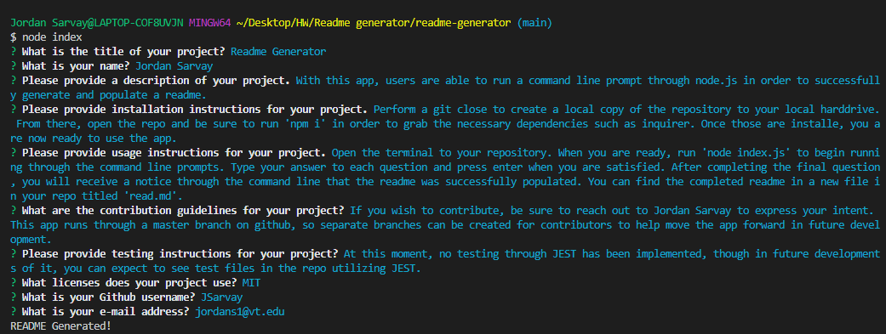

# Readme Generator
### Created by Jordan Sarvay

## Description
With this app, users are able to run a command line prompt through node.js in order to successfully generate and populate a readme.

## Table of Contents
* [Installation](#installation)
* [Usage](#usage)
* [Contributing](#contributing)
* [Testing](#testing)
* [Questions](#questions)
    
## Installation

Perform a 'git clone' to create a local copy of the repository to your local harddrive. From there, open the repo and be sure to run 'npm i' in order to grab the necessary dependencies such as inquirer. Once those are installe, you are now ready to use the app.
    
## Usage

Open the terminal to your repository. When you are ready, run 'node index.js' to begin running through the command line prompts. Type your answer to each question and press enter when you are satisfied. After completing the final question, you will receive a notice through the command line that the readme was successfully populated. You can find the completed readme in a new file in your repo titled 'read.md'.

## Contributing

If you wish to contribute, be sure to reach out to Jordan Sarvay to express your intent. This app runs through a master branch on github, so separate branches can be created for contributors to help move the app forward in future development.
    
## Testing

At this moment, no testing through JEST has been implemented, though in future developments of it, you can expect to see test files in the repo utilizing JEST.
    
## Questions

Please feel free to reach out to either of the following links with questions regarding the use of this application.
Github: [JSarvay](http://github.com/JSarvay/)
E-mail: jordans1@vt.edu

